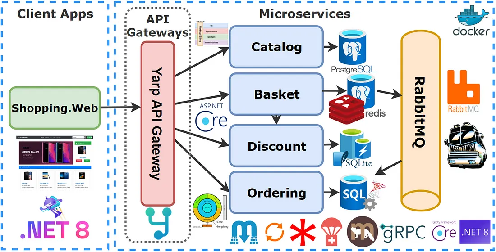

# EShopMicroservices

Based On Develop Microservices on Udemy Course .NET 8 used ASP.NET Web API, Docker, RabbitMQ, MassTransit, gRPC, Yarp Gateway, Redis,SqlServer
Udemy Course:

- https://mehmetozkaya.medium.com/net-8-microservices-ddd-cqrs-vertical-clean-architecture-2dd7ebaaf4bd
- https://www.udemy.com/course/microservices-architecture-and-implementation-on-dotnet/

## Big Picture

# TODO

- Implement** different architecture** **styles:** **DDD, Vertical Slice and Clean Architecture**
- Implement different **patterns: SOLID Principles** , **Dependency Injection** principles, **CQRS ** and **Mediator Pattern** , **Options Pattern** , **Proxy ** and **Decorator Pattern** , **Publish-Subscribe Pattern** , **Api Gateway Pattern** , **Cache-aside Pattern**
- Implements **different Database types: NoSQL ** and **Relational** : Transactional DocumentDB, **PostgreSQL** , **SQLite** , **SQL Server** , **Distributed Caches (Redis)** and **Message brokers ** async communication with **RabbitMQ ** and **Masstransit ** library
- Use **Popular .NET libraries: Carter** , **Marten** , **MediatR** , **FluentValidation** , **Mapster** , **MassTransit** , **EF Core** , **Refit**
- Implement **different communication styles** : **Sync ** and **Async ** communication between microservices
- Build a **Highly Performant inter-service gRPC Communication ** with Discount and Basket Microservice
- Microservices **Async Communication Publish Subscribe Pattern w/ RabbitMQ & MassTransit ** for Checkout Basket Between Basket-Ordering Microservices
- Building **API Gateways with Yarp Reverse Proxy** applying \*_Gateway Routing Pattern_
